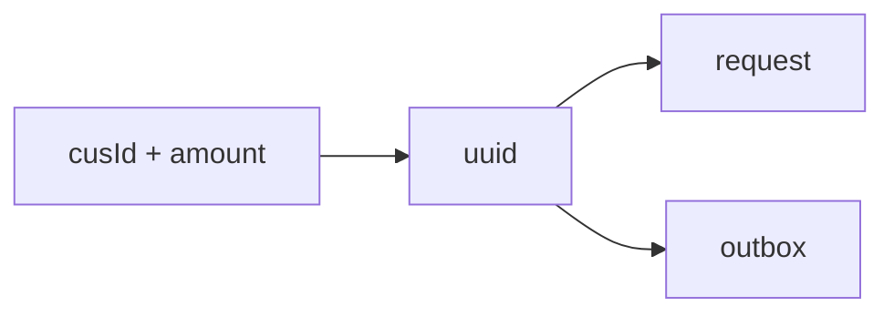
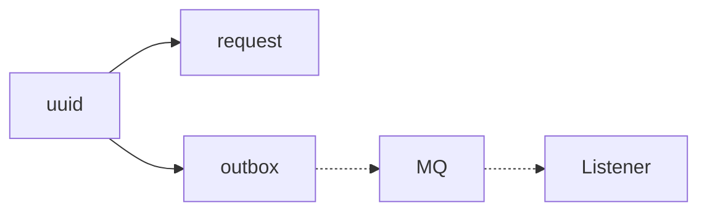

# ChancePay MVP

## Glossary

### Orchestrator side
- **request** – source of truth (`uuid`, `cusId`, `amount`, `succeed`).  
  - `succeed` is `NULL` (pending), `TRUE` (succeed), or `FALSE` (failed).  
  - A request record always exists.  

- **outbox** – message buffer, deleted after successful MQ ack.  

### Wallet side
- **inbox** – processing tracker (`uuid`, `succeed`: `NULL` = pending, `TRUE` = succeed, `FALSE` = failed).  
  - Guards against duplicate processing.  

- **pretend wallet** – a stub that “pretends” to deduct by tossing a coin.  
  - **No actual ledger (`cusId`, `balance`) is maintained in MVP**.  
  - This design makes the orchestrator’s role (consistency, retry, callback handling) stand out.  

---

## Phase 1

- A record is inserted into the **request** table.  
  - This record will always exist.  
  - Its status may remain `PENDING` indefinitely, but it will not disappear.  

- A record is inserted into the **outbox** table.  

---

## Phase 2 

The **Outbox Scanner** periodically scans for pending records and attempts to publish them to the MQ. At this stage, the system guarantees that one of the following conditions will hold:  
1. The record remains in the **outbox** and failures are logged with the tag `[FAILED TO SEND TO MQ]`.  
   - All retry attempts (up to a fixed limit) have failed.  
2. The message is still in the **MQ**.  
3. The message has been consumed at least once by the **Wallet** service.  

---

⚠ **Error handling**  
If a synchronous error occurs during publishing (e.g. MQ connection failure), the program will throw an exception and stop, rather than silently retry.  
This design choice highlights infrastructure-level issues immediately and prevents silent backlog growth in the outbox table.  
Future improvements may include automated alerting to handle such errors without manual intervention.  

---

## Phase 3

**Wallet** processes messages from the MQ with at-least-once semantics.  
For each delivered message, one of the following outcomes will hold:

| Case | Inbox state | Log emitted |
|------|-------------|-------------|
| Payload cannot be parsed | No record | `[PAYLOAD_CORRUPTION_ALERT]` |
| Deduction completed (coin flip) | Record finalized as **FAILED** (`FALSE`) or **SUCCEED** (`TRUE`) | *(no `FAILED TO ...` log)* |

At this stage, the “deduction” never fails mid-way, because it is only a coin flip.  

---

## Phase 4

The **Wallet** side attempts to callback the **Orchestrator** side to update the request status.  
At this stage, the outcomes are:

| Case (remarks)                       | Request table `succeed` | Log emitted |
|--------------------------------------|--------------------------|-------------|
| Callback failed (HTTP error/timeout) | `NULL` (pending)         | `[FAILED TO CALLBACK FROM WALLET]` |
| Callback succeeded                   | `FALSE` or `TRUE`        | *(no `FAILED TO ...` log)* |

---

## Design Rationale

- **Boolean tri-state**: using `NULL` / `TRUE` / `FALSE` directly in DB makes pending explicit and minimal.  
- **Pretend wallet**: the wallet no longer maintains a ledger; it only flips a coin.  
  - This eliminates business logic failures in the wallet itself.  
  - All uncertainty comes from orchestration and callback reliability.  
- **Request–Response symmetry**: orchestrator’s `request` and wallet’s `inbox` mirror each other, just as `outbox` and MQ mirror each other.  
- This makes the orchestrator the clear “protagonist” of the system, while wallet is deliberately reduced to an unreliable external stub.  
