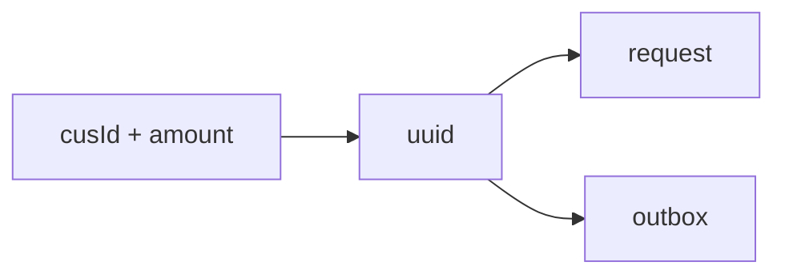
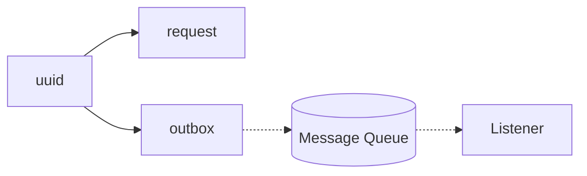

# ChancePay MVP （中文：随缘付）
## 💳 随缘付（ChancePay）｜分布式一致性实验型支付系统 MVP  
**个人独立项目｜Spring Boot · MySQL · RabbitMQ**

这是我在深入学习“最终一致性”原理时，**从零独立构建的一个 MVP 系统**。  
没有套用任何现成脚手架，也没有照抄示例代码。  

我从零搭建了两个微服务子系统（Orchestrator 与 Wallet），系统之间通过 MQ 与 HTTP 通信，
然后我探究他们沟通过程中可能会出现的问题，并提出我自己的解决方案。
最终，我得到一个**所有错误都能被 100% 追溯、逻辑自洽且可解释**的系统，  
在工程意义上实现了分布式事务的一种“收敛性”。

---

### 🔧 系统架构（线性四步流）
1. **Request**：请求写入数据库，`succeed=NULL` 表示 pending。  
2. **Outbox**：同一事务内写入消息缓冲表；若 MQ 异常，记录留存待扫。  
3. **Inbox**：消费者用 `INSERT IGNORE` 去重插入，天然幂等。  
4. **Callback**：Wallet 回调 Orchestrator 更新最终状态（`TRUE` / `FALSE`）。

每一步都有记录，系统永远知道自己“停在哪一步”。

---

### ✳️ 核心特性
- **事务外盒 Outbox**：写库与发消息解耦但强一致，确保消息不会丢。  
- **消费端幂等**：`INSERT IGNORE` + 唯一键抵抗 MQ 重投。  
- **三态状态机**：`NULL / TRUE / FALSE` 表达单向状态，防止重复写入。  
- **显性失败可追溯**：任何异常都会留下确切数据库痕迹或日志。  

---

### 🧠 设计理念
> 我不追求“永不出错”的系统，而是想造一个“出错也能自圆其说”的系统。  
> 每次崩溃都是可解释的状态，而不是黑箱。  

---

**结果：**  
随缘付是一个用于探索分布式一致性的可运行实验平台，  
展示了我在 **事务边界、幂等控制、系统恢复与可观测性** 方面的实际设计能力。

## Glossary

### Orchestrator side
- **request** – source of truth (`uuid`, `cusId`, `amount`, `succeed`).  
  - `succeed` is `NULL` (pending), `TRUE` (succeed), or `FALSE` (failed).  
  - A request record always exists.  

- **outbox** – message buffer, deleted after successful MQ ack.  

### Wallet side
- **inbox** – processing tracker (`uuid`, `succeed`: `NULL` = pending, `TRUE` = succeed, `FALSE` = failed).  
  - Guards against duplicate processing.  

- **pretend wallet** – a stub that “pretends” to deduct by tossing a coin.  
  - **No actual ledger (`cusId`, `balance`) is maintained in MVP**.  
  - This design makes the orchestrator’s role (consistency, retry, callback handling) stand out.  

---

## Phase 1

- A record is inserted into the **request** table.  
  - This record will always exist.  
  - Its status may remain `PENDING` indefinitely, but it will not disappear.  

- A record is inserted into the **outbox** table.  

---

## Phase 2 

The **Outbox Scanner** periodically scans for pending records and attempts to publish them to the MQ. At this stage, the system guarantees that one of the following conditions will hold:  
1. The record remains in the **outbox** and failures are logged with the tag `[FAILED TO SEND TO MQ]`.  
   - All retry attempts (up to a fixed limit) have failed.  
2. The message is still in the **MQ**.  
3. The message has been consumed at least once by the **Wallet** service.  

---

⚠ **Error handling**  
If a synchronous error occurs during publishing (e.g. MQ connection failure), the program will throw an exception and stop, rather than silently retry.  
This design choice highlights infrastructure-level issues immediately and prevents silent backlog growth in the outbox table.  
Future improvements may include automated alerting to handle such errors without manual intervention.  

---

## Phase 3

**Wallet** processes messages from the MQ with at-least-once semantics.  
For each delivered message, one of the following outcomes will hold:

| Case | Inbox state | Log emitted |
|------|-------------|-------------|
| Payload cannot be parsed | No record | `[PAYLOAD_CORRUPTION_ALERT]` |
| Deduction completed (coin flip) | Record finalized as **FAILED** (`FALSE`) or **SUCCEED** (`TRUE`) | *(no `FAILED TO ...` log)* |

At this stage, the “deduction” never fails mid-way, because it is only a coin flip.  

---

## Phase 4

The **Wallet** side attempts to callback the **Orchestrator** side to update the request status.  
At this stage, the outcomes are:

| Case (remarks)                       | Request table `succeed` | Log emitted | Notes |
|--------------------------------------|--------------------------|-------------|-------|
| Callback failed (HTTP error/timeout) | `NULL` (pending)         | `[FAILED TO CALLBACK FROM WALLET]` | In this case, the orchestrator keeps the request pending. Truth can still be recovered by inspecting **inbox** on the Wallet side (manual reconciliation). |
| Callback succeeded                   | `FALSE` or `TRUE`        | *(no `FAILED TO ...` log)* | Request finalized automatically; no need to query inbox. |

---

## Design Rationale

- **Boolean tri-state**: store `succeed` as `NULL` / `TRUE` / `FALSE` to make **pending** explicit and minimal.  
  - Enforce write-once finalization with `... AND succeed IS NULL`.
 
- **Pretend wallet (coin flip)**: deliberately trivializes business logic to foreground **orchestration + eventual consistency**.  
  - This project is about consistency mechanics, **not** showcasing fancy SQL/ledger design.

- **Symmetry**: two mirrored pairs make the system easy to reason about.  
  - **Outbox ↔ Inbox**: producer-side buffer vs. consumer-side idempotency guard.  
  - **Request ↔ Response**: source-of-truth row vs. its finalization via callback (or later reconciliation).

- **Linearity**: the pipeline is strictly forward-only.  
  - If the process stops, it always stops at a **clear and observable** point.  
  - If it advances, it moves **deterministically** to the next stage.  
  - MVP avoids hidden branches/maze-style retries; the flow is simple, finite, and traceable — “随缘”.
