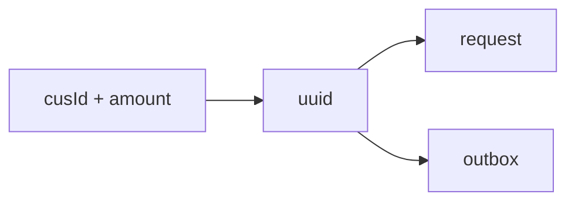
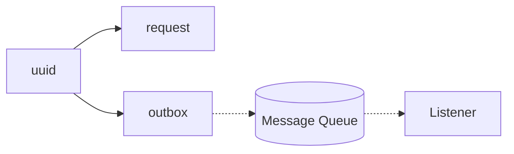

# ChancePay MVP （中文：随缘付）
## 💳 随缘付（ChancePay）｜分布式一致性支付系统 MVP  
**个人独立项目｜Spring Boot · MySQL · RabbitMQ**
---

这是一个我从零手搓的微服务 MVP，用于验证 orchestrator–outbox–MQ–wallet 链路的最终一致性。
目标不是追求高吞吐，而是在低 QPS 下验证系统的正确性与稳定性，确保消息可靠传递、状态幂等、链路闭合。

为保持 MVP 的纯净性，一旦失败后的fallback 机制被设计得极为简洁。

即便如此，系统已能承担现实支付环境中 **“不丢钱、失败绝对有迹可循”** 的检验，具备收敛性与优雅失败的核心特质。
当前实验结果表明，在持续 10 QPS 的负载下，系统能稳定出清 outbox，无积压、无丢失。

## Glossary

### Orchestrator side
- **request** – source of truth (`uuid`, `cusId`, `amount`, `succeed`).  
  - `succeed` is `NULL` (pending), `TRUE` (succeed), or `FALSE` (failed).  
  - A request record always exists.  

- **outbox** – message buffer, deleted after successful MQ ack.  

### Wallet side
- **inbox** – processing tracker (`uuid`, `succeed`: `NULL` = pending, `TRUE` = succeed, `FALSE` = failed).  
  - Guards against duplicate processing.  

- **pretend wallet** – a stub that “pretends” to deduct by tossing a coin.  
  - **No actual ledger (`cusId`, `balance`) is maintained in MVP**.  
  - This design makes the orchestrator’s role (consistency, retry, callback handling) stand out.  

---

## Phase 1

- A record is inserted into the **request** table.  
  - This record will always exist.  
  - Its status may remain `PENDING` indefinitely, but it will not disappear.  

- A record is inserted into the **outbox** table.  

---

## Phase 2 

The **Outbox Scanner** periodically scans for pending records and attempts to publish them to the MQ. At this stage, the system guarantees that one of the following conditions will hold:  
1. The record remains in the **outbox** and failures are logged with the tag `[FAILED TO SEND TO MQ]`.  
   - All retry attempts (up to a fixed limit) have failed.  
2. The message is still in the **MQ**.  
3. The message has been consumed at least once by the **Wallet** service.  

---

⚠ **Error handling**  
If a synchronous error occurs during publishing (e.g. MQ connection failure), the program will throw an exception and stop, rather than silently retry.  
This design choice highlights infrastructure-level issues immediately and prevents silent backlog growth in the outbox table.  
Future improvements may include automated alerting to handle such errors without manual intervention.  

---

## Phase 3

**Wallet** processes messages from the MQ with at-least-once semantics.  
For each delivered message, one of the following outcomes will hold:

| Case | Inbox state | Log emitted |
|------|-------------|-------------|
| Payload cannot be parsed | No record | `[PAYLOAD_CORRUPTION_ALERT]` |
| Deduction completed (coin flip) | Record finalized as **FAILED** (`FALSE`) or **SUCCEED** (`TRUE`) | *(no `FAILED TO ...` log)* |

At this stage, the “deduction” never fails mid-way, because it is only a coin flip.  

---

## Phase 4

The **Wallet** side attempts to callback the **Orchestrator** side to update the request status.  
At this stage, the outcomes are:

| Case (remarks)                       | Request table `succeed` | Log emitted | Notes |
|--------------------------------------|--------------------------|-------------|-------|
| Callback failed (HTTP error/timeout) | `NULL` (pending)         | `[FAILED TO CALLBACK FROM WALLET]` | In this case, the orchestrator keeps the request pending. Truth can still be recovered by inspecting **inbox** on the Wallet side (manual reconciliation). |
| Callback succeeded                   | `FALSE` or `TRUE`        | *(no `FAILED TO ...` log)* | Request finalized automatically; no need to query inbox. |

---

## Design Rationale

- **Boolean tri-state**: store `succeed` as `NULL` / `TRUE` / `FALSE` to make **pending** explicit and minimal.  
  - Enforce write-once finalization with `... AND succeed IS NULL`.
 
- **Pretend wallet (coin flip)**: deliberately trivializes business logic to foreground **orchestration + eventual consistency**.  
  - This project is about consistency mechanics, **not** showcasing fancy SQL/ledger design.

- **Symmetry**: two mirrored pairs make the system easy to reason about.  
  - **Outbox ↔ Inbox**: producer-side buffer vs. consumer-side idempotency guard.  
  - **Request ↔ Response**: source-of-truth row vs. its finalization via callback (or later reconciliation).

- **Linearity**: the pipeline is strictly forward-only.  
  - If the process stops, it always stops at a **clear and observable** point.  
  - If it advances, it moves **deterministically** to the next stage.  
  - MVP avoids hidden branches/maze-style retries; the flow is simple, finite, and traceable — “随缘”.
