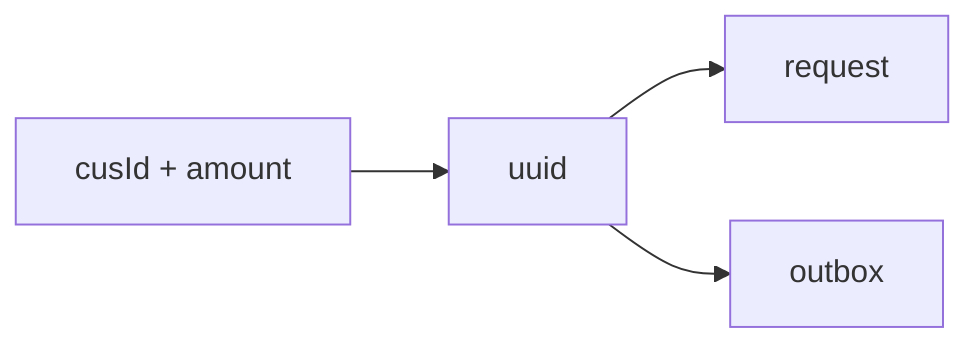
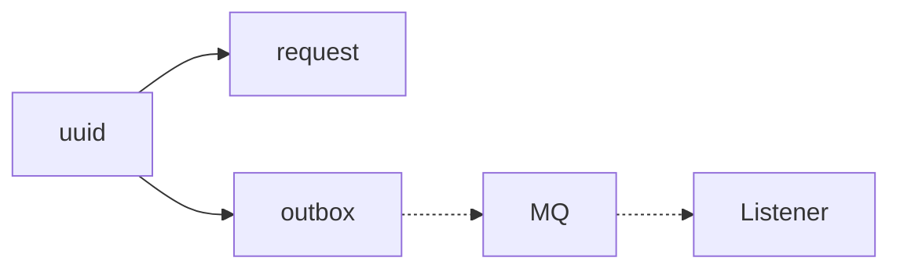
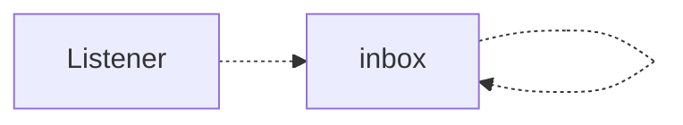

## Glossary

### Orchestrator side
- **request** – source of truth (`uuid`, `cusId`, `amount`, `status`). Always exists.  
- **outbox** – message buffer, deleted after successful MQ ack.  

### Wallet side
- **wallet** – customer ledger (`cusId`, `balance`).  
- **inbox** – processing tracker (`uuid`, `status`: `PENDING` / `FAILED` / `SUCCEED`).  

## Phase 1

- A record is inserted into the **request** table.  
  - This record will always exist.  
  - Its status may remain `PENDING` indefinitely, but it will not disappear.  

- A record is inserted into the **outbox** table.

## Phase 2 

The **Outbox Scanner** periodically scans for pending records and attempts to publish them to the MQ. At this stage, the system guarantees that one of the following conditions will hold: 
1. The record remains in the **outbox** and failures are logged with the tag `[FAILED TO SEND TO MQ]`.
   - All retry attempts (up to a fixed limit) have failed.
2. The message is still in the **MQ**.
3. The message has been consumed at least once by the **Wallet** service.

---

⚠ **Error handling**  
If a synchronous error occurs during publishing (e.g. MQ connection failure), the program will throw an exception and stop, rather than silently retry.  
This design choice highlights infrastructure-level issues immediately and prevents silent backlog growth in the outbox table.  
Future improvements may include automated alerting to handle such errors without manual intervention.   

## Phase 3

**Wallet** processes messages from the MQ with at-least-once semantics.  
On each delivered message, one of the following outcomes will hold:

| Case | Inbox state | Log emitted |
|------|-------------|-------------|
| Payload cannot be parsed | No record | ` [PAYLOAD_CORRUPTION_ALERT]` |
| Deduction program failed to complete | Record exists with **PENDING** status | ` [FAILED TO DEDUCT FROM WALLET]` |
| Deduction process completed| Record finalized as **FAILED** or **SUCCEED** | *(no `FAILED TO ...` log)* |

## Phase 4

The **Wallet** side attempts to callback the **Orchestrator** side to update the request status.  
At this stage, the outcomes are:

| Case (remarks)                       | Request table status | Log emitted |
|--------------------------------------|----------------------|-------------|
| Callback failed (HTTP error/timeout) | **PENDING**          | ` [FAILED TO CALLBACK FROM WALLET]` |
| Callback succeeded                   | **FAILED** or **SUCCEED** | *(no `FAILED TO ...` log)* |

